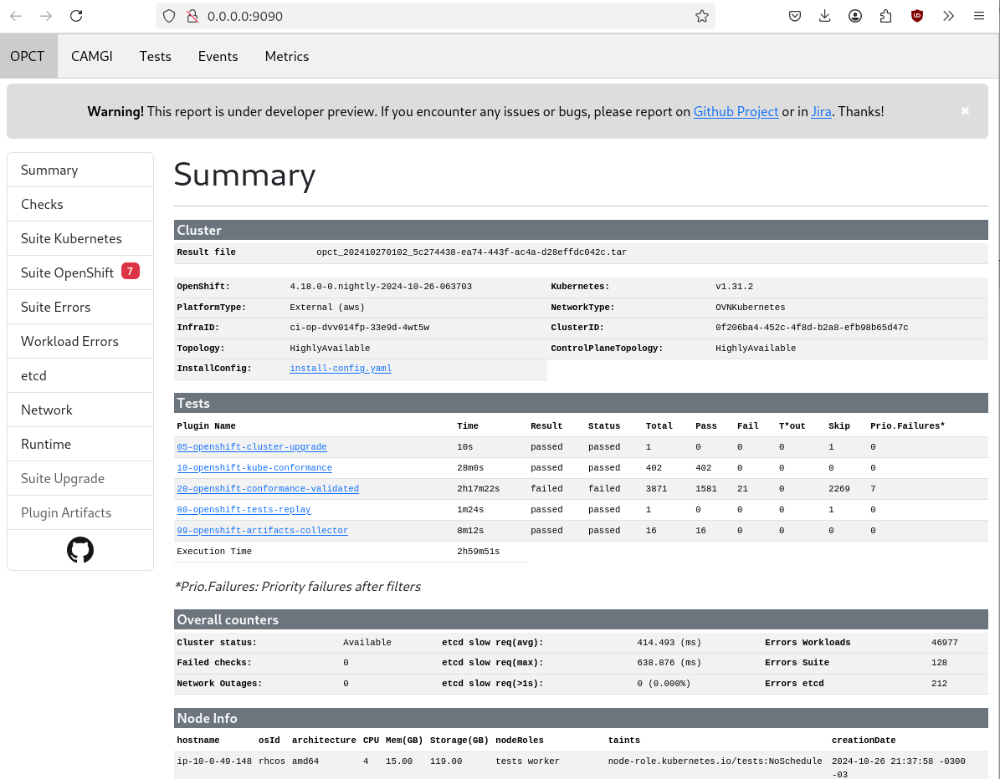

# `opct report`

`opct report` generates a comprehensive report from the conformance workflow executed on the OpenShift/OKD cluster.

The report is available in two formats:

- Command Line Interface (CLI)
- Web User Interface (Web UI)

## Options

```txt
--8<-- "docs/assets/output/opct-report.txt"
```

## Examples

### CLI Report

To generate a CLI report, run the following command:

```sh
./opct report ./opct_202502230112_624d66d9-6354-40d1-b847-82a55f57d444.tar
```

The output will be similar to:

```txt
--8<-- "docs/assets/output/opct-report_example-cli.txt"
```

### Web UI Report

To generate a Web UI report, follow these steps:

1. Run the command:

    ```sh
    ./opct report --save-to ./results ./opct_202502230112_624d66d9-6354-40d1-b847-82a55f57d444.tar
    ```

2. Open your browser and navigate to [localhost:9090](http://localhost:9000).


